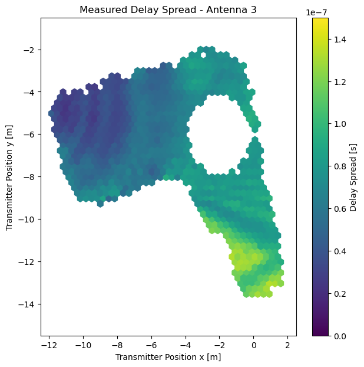
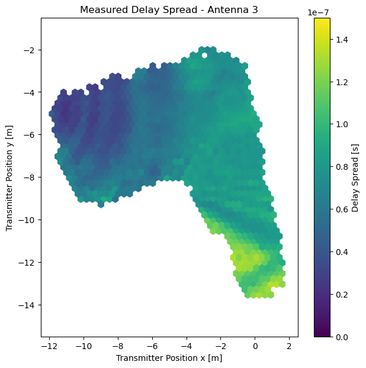
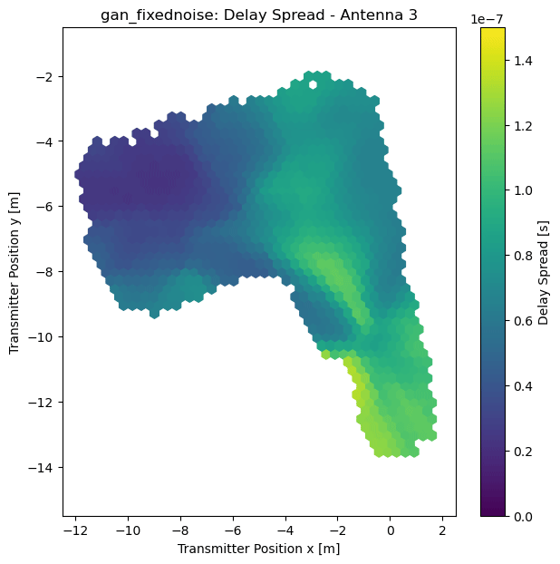
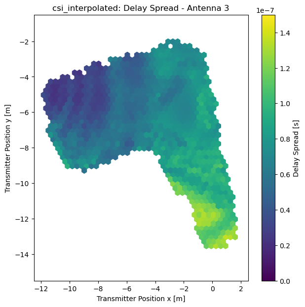

# GAN-based massive MIMO channel model trained on measured data

This repository contains the source code for the paper

> Florian Euchner, Janina Sanzi, Marcus Henninger, Stephan ten Brink: "GAN-based massive MIMO channel model trained on measured data"

presented at the 27th International Workshop on Smart Antennas (WSA 2024) in March 2024.

### Visualization: RMS delay spread of measured and generated CSI data

We use a subset of [dichasus-cf0x](https://dichasus.inue.uni-stuttgart.de/datasets/data/dichasus-cf0x/) as training set and another disjoint subset of the same dataset as test set.
As an additional challenge, we cut a "hole" into the training set, like so:

Training Set | Test Set
:-:|:-:
 | 

(Note that it may seem like training set and test set are actually the same points, but that is not the case. However, they were of course captured in the same environment, so they have the same "L-shaped" top view map.)

Next, we train a conditional WGAN to generate more CSI data at arbitrary datapoints.
We let it generate CSI data a the test set locations:

GAN-generated (fixed noise) | GAN-generated (random noise)
:-:|:-:
 | 

The GAN's generator gets a noise vector as its input.
We can either fixate this noise vector over all positions (conditions) to get some level of spatial consistency (left diagram), or just provide a random noise sample for every location (right diagram).

Finally, we could also just generate datapoints by linear interpolation of the existing CSI datapoints:

Linear Interpolation | Test Set (again)
:-:|:-:
 | 

For comparison, the delay spread visualized over the measured test set is shown again on the right.
Juding by the RMS delay spread, it appears that the interpolated CSI and the real CSI are almost the same, except for the "hole" in the training set, where the linear interpolator had to fill in CSI data.

Please read the paper and look at the Jupyter Notebooks for more results.

### Usage
The Jupyter Notebooks in this repository are numbered.
You must execute them in the right order.
The `results` directory contains some intermediate results.
Note that not all intermediate results (especially not generated CSI data) are pushed to GitHub.

* `0_DownloadDatasets.ipynb`: Download parts of the [dichasus-cf0x](https://dichasus.inue.uni-stuttgart.de/datasets/data/dichasus-cf0x/) dataset that we use for training and testing. Due to the large file size, this dataset is not included in this git repository.
* `1_Positions.ipynb`: Extract positions of training set and test set datapoints.
* `2_DelaySpread.ipynb`: Compute delay spread of training set and test set datapoints.
* `3_LinearInterpolation.ipynb`: Linear interpolation baseline, generate linearly interpolated CSI at test set datapoint locations.
* `4_TrainGAN.ipynb`: Train the Generative Adverserial Network. This is probably the most important file of this repository.
* `5_EvaluateGAN.ipynb`: Use trained generator to produce CSI.
* `6_Evaluate_DS.ipynb`: Plot delay spread of measured CSI, GAN-generated and interpolated CSI.
* `7_Evaluate_AngleDistribution.ipynb`: Plot angle of arrival estimates of measured CSI, GAN-generated and interpolated CSI.
* `8_Evaluate_PowerDistribution.ipynb`: Plot signal power of measured CSI, GAN-generated and interpolated CSI.

### Caveats / Conclusion
In my opinion, GAN-based channel modelling is an interesting idea, but having worked on a GAN-based channel model, I don't really think they are useful in their current state.
This is due to them lacking the ability to generalize, lack of meaningful spatial consistency and, most importantly, the lack of interpretability (refer to the paper for more information and arguments).
**Instead of using a GAN-based channel model, consider just using the channel dataset directly!**

### Cite
```
@inproceedings{euchner2024gan,
	author    = {Euchner, Florian and Sanzi, Janina and Henninger, Marcus and ten Brink, Stephan},
	title     = {{GAN-based massive MIMO channel model trained on measured data}},
	booktitle = {27th International Workshop on Smart Antennas},
	year      = {2024}
}
```